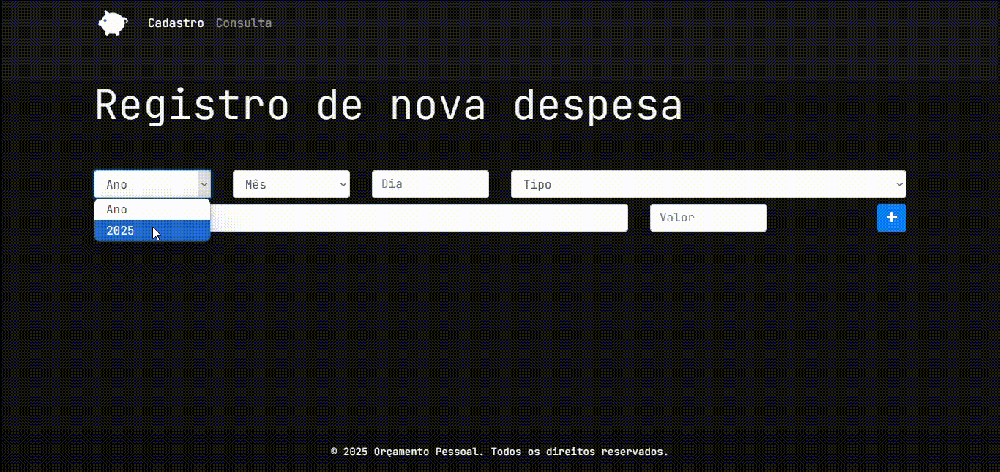

# 💰 App Orçamento Pessoal - Controle Financeiro Inteligente

<div align="center">

  

</div>

Um aplicativo web intuitivo para gestão financeira pessoal, desenvolvido com as melhores práticas de desenvolvimento front-end. Controle suas despesas de forma simples e eficiente!

[](https://opensource.org/licenses/MIT)


## 🎥 Demonstração



## ✨ Funcionalidades Destacadas

### 📅 Registro Inteligente
- 🗓️ Seletor de data integrado (dia/mês/ano)
- 📋 Categorização automática (Alimentação, Educação, Saúde, etc.)
- ⚡ Validação em tempo real dos campos
- 💾 Armazenamento local persistente

### 🔍 Consulta Avançada
- 🔎 Sistema de filtros combinados
- 🗂️ Visualização tabular organizada
- 📊 Ordenação por data/categoria/valor
- 🗑️ Exclusão segura com confirmação

### 🛠️ Técnicas Avançadas
- 🧩 Arquitetura modular em classes ES6
- 📦 Persistência em LocalStorage
- 🎨 Design System consistente
- 📱 Layout responsivo

## 🛠️ Tecnologias Utilizadas

| Camada          | Tecnologias                                                                 |
|-----------------|-----------------------------------------------------------------------------|
| **Frontend**    | HTML5, CSS3, JavaScript (ES6+)                                              |
| **Framework**   | Bootstrap 4.0.0                                                             |
| **Ícones**      | Font Awesome 5.0.8                                                          |
| **Fontes**      | JetBrains Mono (UI), League Spartan (Títulos)                               |
| **Armazenamento**| LocalStorage (IndexedDB-like)                                              |

## 🚀 Como Usar

1. **Acesso Imediato**
   ```bash
   # Clone o repositório
   git clone https://github.com/DanAntunes/orcamento-pessoal.git
   
   # Inicie o servidor local
   cd orcamento-pessoal && npx serve
   ```

2. **Fluxo Principal**
   - **Cadastro**: 
     1. Selecione a data
     2. Escolha a categoria
     3. Insira descrição e valor
     4. Salve com um clique!

   - **Consulta**:
     1. Use filtros combinados
     2. Ordene por qualquer coluna
     3. Ações rápidas com ícones

## 📦 Estrutura do Projeto

```
orcamento-pessoal/
├── src/
│   ├── assets/
│   │   ├── css/
│   │   │   └── style.css        # Estilos principais
│   │   ├── scripts/
│   │   │   └── app.js           # Lógica da aplicação
│   │   └── images/              # Assets visuais
│   └── page/
│       └── consulta.html        # Página de consulta
├── index.html                   # Página principal
└── README.md                    # Documentação
```

## 🛡️ Considerações de Segurança

⚠️ **Atenção**: Por se tratar de uma aplicação frontend pura:
- Todos os dados são armazenados localmente no navegador
- Não requer autenticação
- Recomendado para uso pessoal em dispositivos seguros

## 📌 Roadmap Futuro

- [ ] Sincronização com Google Drive
- [ ] Gráficos de análise de gastos
- [ ] Sistema de categorias customizáveis
- [ ] Modo noturno/diurno

## 👨💻 Desenvolvedor

Dan Antunes  
[](https://danantunes-github-io.vercel.app)
[](https://www.linkedin.com/in/dan-de-jesus/)

---

**Licença MIT** - © 2025 Dan Antunes. Consulte o arquivo [LICENSE](LICENSE) para detalhes.


